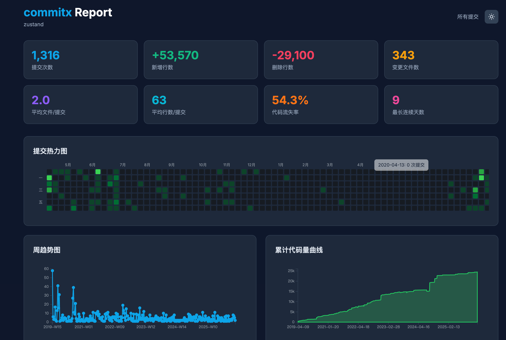

# commit-report

[](https://www.npmjs.com/package/commit-report)
[](https://github.com/qqzhangyanhua/commitx/blob/main/LICENSE)
[](https://github.com/qqzhangyanhua/commitx)

Git 提交统计工具，递归扫描目录中的 Git 仓库，生成可视化 HTML 报告。

## 预览

### 主界面


### 数据统计


### 高级分析


## 特性

- **递归扫描**：自动发现目录下所有 Git 仓库
- **多仓库支持**：交互式选择要分析的仓库，支持合并统计
- **多维度统计**：提交次数、代码行数、作者贡献、文件类型、目录活跃度、时间分布
- **可视化报告**：生成单文件 HTML 报告，包含 5 种 D3.js 交互式图表
- **明暗主题**：支持亮色/暗色主题切换，自动跟随系统设置

## 安装

```bash
# 全局安装
npm install -g commit-report

# 或直接使用 npx
npx commit-report
```

## 使用

```bash
# 默认：扫描当前目录，统计最近 3 个月
commit-report

# 指定时间预设
commit-report --period 7d      # 最近 7 天
commit-report --period 1m      # 最近 1 个月
commit-report --period 6m      # 最近 6 个月
commit-report --period 1y      # 最近 1 年

# 自定义时间范围
commit-report --from 2024-01-01 --to 2024-06-30

# 指定目录
commit-report /path/to/projects

# 指定作者
commit-report --author "Alice"

# 自定义输出文件名
commit-report --output my-report.html

# 不自动打开浏览器
commit-report --no-open
```

## 参数

| 参数 | 缩写 | 默认值 | 说明 |
|------|------|--------|------|
| `--period` | `-p` | `3m` | 时间预设 (7d/1m/3m/6m/1y) |
| `--from` | `-f` | - | 起始日期 (YYYY-MM-DD) |
| `--to` | `-t` | - | 结束日期 (YYYY-MM-DD) |
| `--author` | `-a` | - | 过滤作者 |
| `--output` | `-o` | `commit-report.html` | 输出文件 |
| `--no-open` | - | `false` | 不打开浏览器 |
| `--depth` | `-d` | `20` | 最大扫描深度 |

## 报告包含

- **概要卡片**：提交次数、新增行数、删除行数、变更文件数
- **提交热力图**：GitHub 风格日历热力图
- **时间分布图**：24 小时提交时间柱状图
- **文件类型占比**：甜甜圈图展示代码语言分布
- **作者排行榜**：按提交次数排名的横向柱状图
- **目录活跃度**：TOP 10 最活跃目录

## 开发

```bash
# 安装依赖
pnpm install

# 开发模式（监听文件变化）
pnpm dev

# 构建
pnpm build

# 本地测试
node dist/index.js --no-open /path/to/repos
```

## 技术栈

- TypeScript + tsup 构建
- Commander.js (CLI 参数解析)
- Inquirer.js (交互式选择)
- D3.js (数据可视化)
- Tailwind CSS (报告样式)

## 问题反馈

如果遇到问题或有功能建议，欢迎提交 [Issue](https://github.com/qqzhangyanhua/commitx/issues)。

## License

MIT © [qqzhangyanhua](https://github.com/qqzhangyanhua)

## 链接

- [GitHub 仓库](https://github.com/qqzhangyanhua/commitx)
- [npm 包页面](https://www.npmjs.com/package/commit-report)
- [问题追踪](https://github.com/qqzhangyanhua/commitx/issues)
